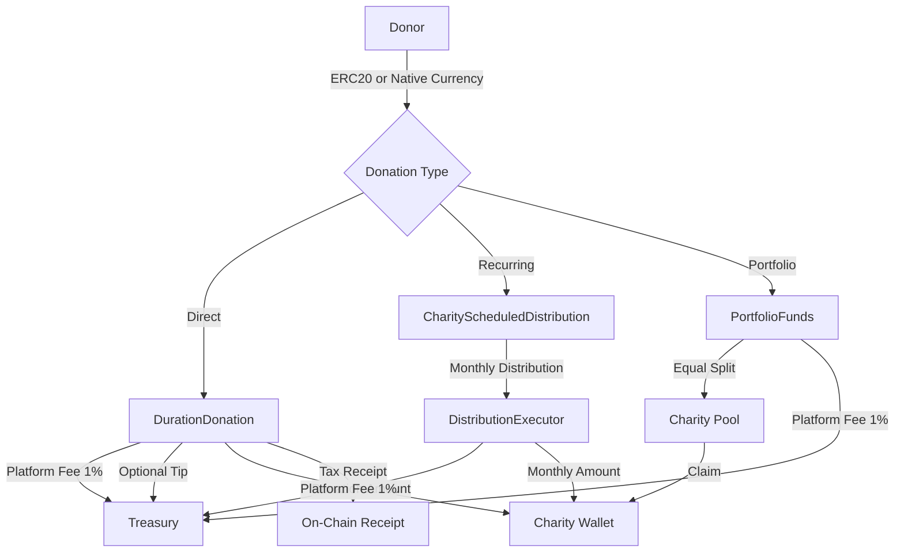

# Give Protocol Smart Contracts

Smart contracts powering Give Protocol, a Delaware-based 501(c)(3) nonprofit building transparent, blockchain-based charitable giving infrastructure. These contracts handle donation processing, recurring distributions, portfolio fund management, and volunteer verification across multiple EVM-compatible networks.

## Security and Trust

Security is the top priority for contracts handling charitable funds. The following measures are in place:

**Smart Contract Protections:**
- OpenZeppelin v5.4 battle-tested libraries (ReentrancyGuard, Pausable, AccessControl, SafeERC20)
- Checks-effects-interactions pattern enforced throughout
- All external calls protected against reentrancy
- Owner-only administrative functions with role-based access control
- Emergency pause functionality on all donation contracts

**Static Analysis and Fuzzing:**
- Slither static analysis integrated into CI (`npm run slither`)
- ConsenSys Diligence Fuzzing via Scribble annotations
- Solhint linting for Solidity best practices
- DeepSource and SonarCloud code quality scanning
- GitHub Actions security scanning (Trivy)

**Testing:**
- 1,670 lines of test code across 4 test suites
- Gas usage reporting for all contract methods
- Solidity coverage reports (`npm run test:coverage`)

**Audits:**
- No formal third-party audit has been completed yet. One is planned before mainnet deployment.

**Security Contact:**
- Report vulnerabilities to security@giveprotocol.io
- See [SECURITY.md](SECURITY.md) for the full responsible disclosure policy.

## Protocol Overview

Give Protocol's smart contracts implement a complete charitable giving system with three core financial flows:



**Platform Fee Structure:**
- Default platform fee: 1% (100 basis points)
- Maximum cap: 5% (500 basis points), enforced on-chain
- Optional donor tips: 5%, 10%, or 20% suggested tiers
- All donations (including tips) are tax-deductible; dual-beneficiary receipts are generated on-chain

**Minimum Donation Thresholds:**
- Direct donations: 0.001 tokens (1e15 wei)
- Scheduled donations: $10 USD equivalent per month (validated via on-chain token price)

## Contracts

### DurationDonation.sol

Core donation contract for direct giving. Accepts both ERC20 tokens and native currency (ETH/GLMR/DEV). Generates on-chain tax receipts with dual-beneficiary support (charity + platform tip). Includes charity registration, activation management, and pausable operations.

**Key methods:** `processDonation()`, `donateNative()`, `registerCharity()`, `updateCharityStatus()`

### PortfolioFunds.sol

Curated charity portfolio management. Donors contribute to a named fund containing up to 10 charities with fixed distribution ratios. Charities claim their allocations (single or batch). Governance-controlled ratio updates are supported but not yet activated.

**Key methods:** `createPortfolioFund()`, `donateToFund()`, `claimFunds()`, `claimMultipleTokens()`

### CharityScheduledDistribution.sol

Recurring monthly donations over 1-60 months. Validates minimum $10 USD per month using on-chain token pricing. Donors can cancel at any time and receive a refund of the remaining balance. Monthly distributions are executed by the DistributionExecutor.

**Key methods:** `createSchedule()`, `executeDistributions()`, `cancelSchedule()`, `setTokenPrice()`

### VolunteerVerification.sol

On-chain verification of volunteer applications and hours. Charities register and then verify volunteer contributions, creating immutable records of service.

**Key methods:** `verifyApplication()`, `verifyHours()`, `checkApplicationVerification()`

### DistributionExecutor.sol

Batch execution helper for CharityScheduledDistribution. Processes up to 100 scheduled distributions per call.

**Key method:** `executeDistributionBatch(startId, endId)`

## Deployed Addresses

### Moonbase Alpha (Testnet -- Chain ID: 1287)

| Contract | Address |
|----------|---------|
| DurationDonation | `0xFbcB6a8aFd5ec1CEC27065CB565C3dd8578E921F` |
| CharityScheduledDistribution | `0xeD6E35A0fa75d4330b7c6Fc02A2EE61AA25386F0` |
| DistributionExecutor | `0x3C1d1f67Bb190119d0727fafA59977cAA424A4AB` |
| VolunteerVerification | `0xEEE43F7c205e93F1eD665d656C3Eb74a977be5d0` |
| MockERC20 (test token) | `0x0A21b2D5c9A20cC9EDE60C3257d6f40B7CD7eC40` |

Deployer: `0x8cFc24Ad1CDc3B80338392f17f6e6ab40552e1C0`
Deployed: November 25, 2025

Verify contracts on [Moonscan (Moonbase)](https://moonbase.moonscan.io/).

### Base, Optimism, Moonbeam (Mainnet)

Mainnet deployments are pending. The deployment infrastructure supports all six target networks. See the [Deployment](#deployment) section for details.

## Getting Started

### Prerequisites

- Node.js 18+
- npm

### Installation

```bash
git clone https://github.com/GiveProtocol/give-protocol-contracts.git
cd give-protocol-contracts
npm install
```

### Environment Configuration

Copy `.env.example` to `.env` and fill in the required values:

```env
# Deployer wallet (never commit this)
PRIVATE_KEY=your_private_key_here

# Treasury addresses (one per target network)
BASE_TREASURY_ADDRESS=0x...
OPTIMISM_TREASURY_ADDRESS=0x...
MOONBEAM_TREASURY_ADDRESS=0x...

# RPC endpoints (defaults provided for public RPCs)
MOONBASE_RPC_URL=https://rpc.api.moonbase.moonbeam.network
BASE_SEPOLIA_RPC_URL=https://sepolia.base.org
OPTIMISM_SEPOLIA_RPC_URL=https://sepolia.optimism.io

# Block explorer API keys (for contract verification)
MOONSCAN_API_KEY=
BASESCAN_API_KEY=
OPTIMISM_ETHERSCAN_API_KEY=

# Gas reporting (optional)
REPORT_GAS=true
COINMARKETCAP_API_KEY=
```

## Development

```bash
# Compile contracts (Solidity 0.8.20, optimizer: 200 runs)
npm run compile

# Run test suite
npm run test

# Generate coverage report
npm run test:coverage

# Lint Solidity files
npm run lint:sol

# Run Slither static analysis
npm run slither

# Start local Hardhat node
npm run node
```

### Fuzzing

The project uses ConsenSys Diligence Fuzzing with Scribble annotations:

```bash
npm run fuzz:arm     # Instrument contracts with Scribble
npm run fuzz:run     # Run fuzzing campaign
npm run fuzz:disarm  # Remove instrumentation
```

See [FUZZING.md](FUZZING.md) for setup details.

## Deployment

The universal deployment script (`scripts/deploy-universal.cjs`) supports all target networks:

```bash
# Testnets
npm run deploy:moonbase
npm run deploy:base-sepolia
npm run deploy:optimism-sepolia
npm run deploy:all-testnets

# Mainnets
npm run deploy:moonbeam
npm run deploy:base
npm run deploy:optimism
npm run deploy:all-mainnets
```

Deployed addresses are written to `deployments/addresses.json` and network-specific files in `deployments/`. Contracts are automatically verified on the corresponding block explorer.

See [DEPLOY_TO_MOONBASE.md](DEPLOY_TO_MOONBASE.md) for a step-by-step testnet deployment walkthrough.

### Supported Networks

| Network | Type | Chain ID | Explorer |
|---------|------|----------|----------|
| Moonbase Alpha | Testnet | 1287 | [moonscan.io](https://moonbase.moonscan.io/) |
| Base Sepolia | Testnet | 84532 | [basescan.org](https://sepolia.basescan.org/) |
| Optimism Sepolia | Testnet | 11155420 | [etherscan.io](https://sepolia-optimism.etherscan.io/) |
| Moonbeam | Mainnet | 1284 | [moonscan.io](https://moonscan.io/) |
| Base | Mainnet | 8453 | [basescan.org](https://basescan.org/) |
| Optimism | Mainnet | 10 | [etherscan.io](https://optimistic.etherscan.io/) |

## Project Structure

```
give-protocol-contracts/
├── contracts/                # Solidity source files
│   ├── DurationDonation.sol
│   ├── PortfolioFunds.sol
│   ├── CharityScheduledDistribution.sol
│   ├── VolunteerVerification.sol
│   ├── DistributionExecutor.sol
│   └── MockERC20.sol
├── test/                     # Hardhat + Chai test suites
├── scripts/                  # Deployment and utility scripts
├── deployments/              # Deployed contract addresses (JSON)
├── hardhat.config.cjs        # Hardhat configuration
├── .env.example              # Environment variable template
├── SECURITY.md               # Security policy
├── DEPLOY_TO_MOONBASE.md     # Deployment guide
└── FUZZING.md                # Fuzzing setup guide
```

## Dependencies

- **@openzeppelin/contracts ^5.4.0** -- Access control, token safety, reentrancy guards
- **@chainlink/contracts ^1.4.0** -- Price feed oracles
- **hardhat ^2.26.3** -- Compilation, testing, deployment
- **solidity-coverage ^0.8.16** -- Code coverage
- **slither ^0.7.10** -- Static security analysis
- **solhint ^5.2.0** -- Solidity linting

## Repository Context

This repository is part of the Give Protocol multi-repo architecture:

| Repository | Purpose |
|------------|---------|
| [give-protocol-contracts](https://github.com/GiveProtocol/give-protocol-contracts) | Smart contracts (this repo) |
| [give-protocol-webapp](https://github.com/GiveProtocol/give-protocol-webapp) | React web application |
| [give-protocol-backend](https://github.com/GiveProtocol/give-protocol-backend) | Supabase database and admin |
| [give-protocol-docs](https://github.com/GiveProtocol/give-protocol-docs) | Documentation site |

## License

UNLICENSED -- Private Repository
